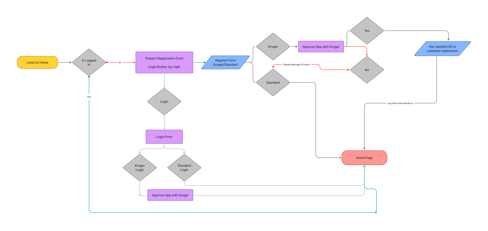
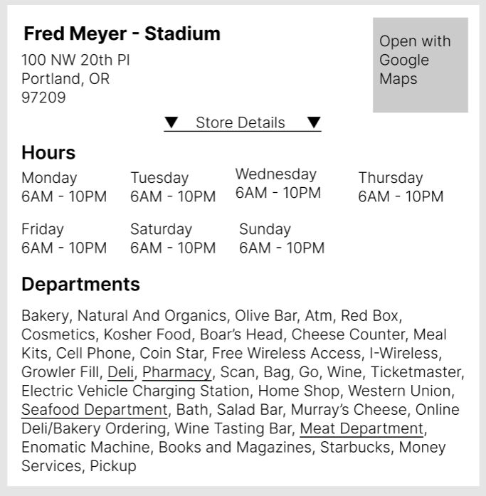
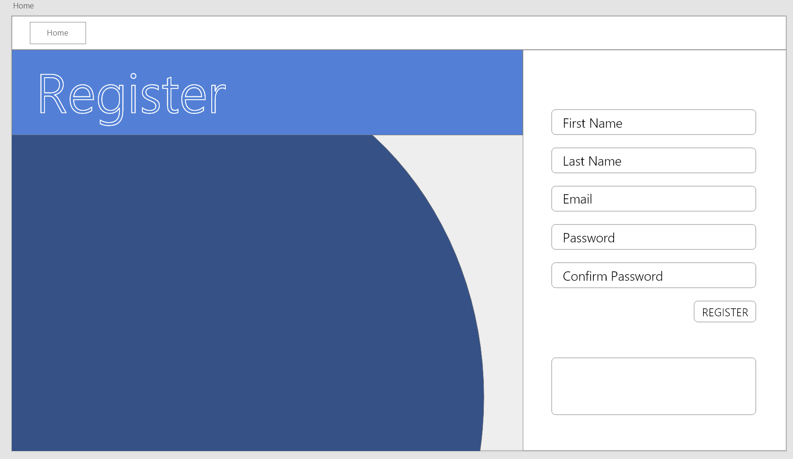
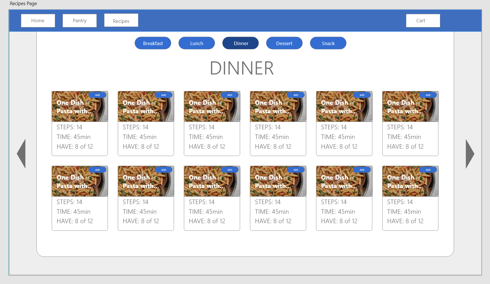
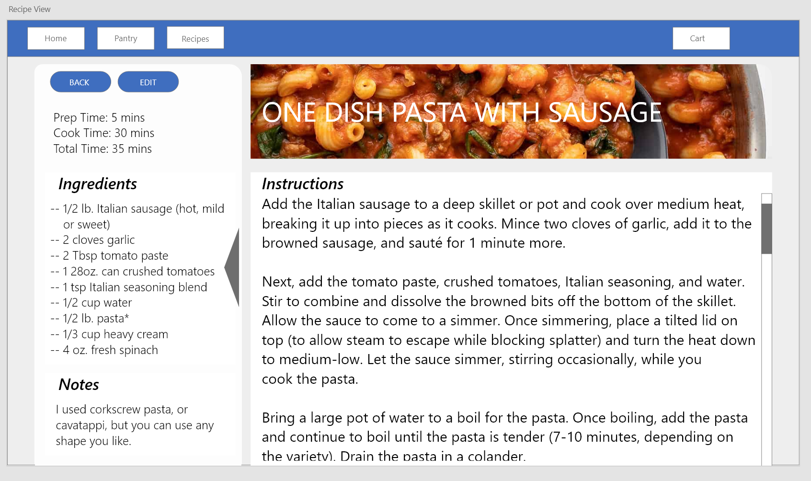
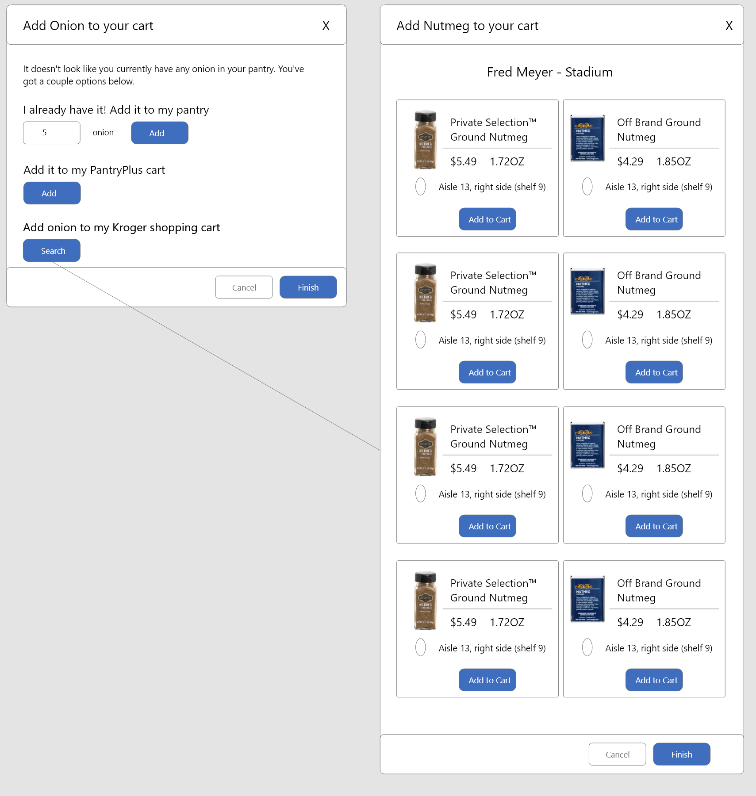
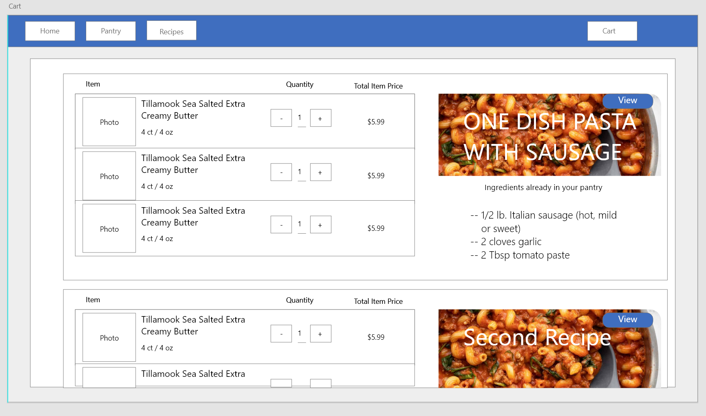

# _PantryPlus.Recipes_

#### By _Daniel Lindsey_

#### _User interface for managing personal recipes and items in your pantry._

## Technologies Used

- _C#_
- _.NET Framework_
- _HTML_
- _CSS_
- _MDBootstrap / Bootstrap_
- _Javascript_
- _jQuery_
- _MySQL_
- _Oauth2_

## Description

This is a C# web application called PantryPlus.Recipes. It will allow sign in for users with Kroger authentication, and allows users to upload, view, and edit recipes. Users can also add what items they have in their pantry/fridge at home, and auto add items not currently in their pantry to their Kroger cart. From there, a user would be able to then proceed with a curbside pickup with Kroger. I plan to also enable calling 3rd party websites for recipe suggestions.

For styling, this project will utilize MDBootstrap, a library combining the best features of Twitter's Bootstrap and Google's Material Design.

 

# Setup/Installation Requirements

## Cloning the repository

To view this application, you must clone it to your computer. To do so,

1. First, close the repository to your PC by locating and clicking the green Code button at the top of the page, and choosing the option to _Download ZIP_.
2. Once downloaded, navigate to your Downloads folder and extract the contents to a location of your choosing.

## Installing C# and .NET

Once the project is downloaded to your computer, you will need to download and install C# and the .NET SDK.

1. First, download and install the .NET 5 SDK

- [Mac](https://dotnet.microsoft.com/download/dotnet/thank-you/sdk-5.0.401-macos-x64-installer)
- [Windows](https://dotnet.microsoft.com/download/dotnet/thank-you/sdk-5.0.401-windows-x64-installer)

2. Once installed, open the project in VS Code (if it is not already open)
   and access a new terminal via the menu at top of VS Code.
3. Type the following command:
   - **_dotnet tool install -g dotnet-script_**
4. Next, configure your terminal environment with the following command

   - Mac: **_echo 'export PATH=$PATH:~/.dotnet/tools' >> ~/.zshrc_**
   - Windows: **_echo 'export PATH=$PATH:~/.dotnet/tools' >> ~/.bash_profile_**
      
      

## Setting up the database

Prior to running the application, you will need to install MySQL and MySQL Workbench.

- During install, take note of the password you set for MySQL.
   

[Mac and Windows Download Link](https://dev.mysql.com/downloads/workbench/)

1. Once installed, open MySQL Workbench to import the database.
2. In the Navigator > Administration window, select Data Import/Restore.
3. In Import Options select Import from Self-Contained File.
4. Navigate to the root directory of the cloned project.
5. Under Default Schema to be Imported To, select the New button.
6. Enter a name for the database (ex: hair_salon)
7. Click Ok.
8. Navigate to the tab called Import Progress and click Start Import at the bottom right corner of the window.
9. After you are finished with the above steps, reopen the Navigator > Schemas tab. Right click and select Refresh All. Your new database should now appear.

## Set up appsettings.json

Once the database is imported, you will need to tell the application how to access it.

1. In the HairSalon directory, create a file called appsettings.json
2. Paste the following into the file, editing both the database name and the password in the string.

   {
   "ConnectionStrings": {
   "DefaultConnection": "Server=localhost;Port=3306;database=(my-database-name-here);uid=root;pwd=(my-password-here);"
   }
   }

 

# Known Bugs

- _The site is currently under development. As such, there are a lot of bugs._

 

# License

_MIT_

Copyright (c) _5-1-2022_ _Daniel Lindsey_

 

## User Flows and Design Templates

 

 

 

 

 

 

## TO-DO

fix img upload
remove home button
re-route home to /recipes
