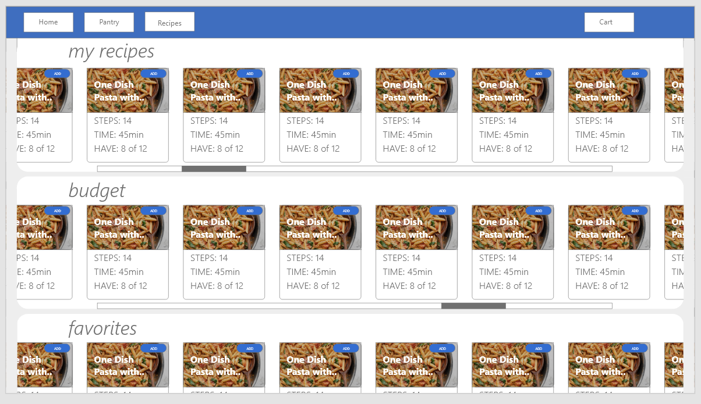

# _PantryPlus.Recipes_

#### By _Daniel Lindsey_

#### _User interface for managing personal recipes and items in your pantry._

## Technologies Used

- _C#_
- _.NET Framework_
- _HTML_
- _CSS_
- _MDBootstrap / Bootstrap_
- _Javascript_
- _jQuery_
- _MySQL_
- _Oauth2_

## Description

This is a C# web application called PantryPlus.Recipes. It will allow sign in for users with Kroger authentication, and allows users to upload, view, and edit recipes. Users can also add what items they have in their pantry/fridge at home, and auto add items not currently in their pantry to their Kroger cart.

From there, a user would be able to then proceed with a curbside pickup with Kroger. If you do not want to add in your own recipes, you can call the Tasty API or HelloFresh API to get recipe ideas.

For styling, this project utilizes MDBootstrap, a library combining the best features of Twitter's Bootstrap and Google's Material Design.

 

## Viewing The Live Site

This application is hosted at https://pantryplus.recipes. At this time, most of all the features rely on the use of a Kroger account (Fred Meyer, Fry's, etc) but I plan on adding in functionality as time allows for non-Kroger authenticated accounts.

There are still many bugs to be worked out. Currently, the cart (a green cart icon inside of a recipe) and pantry (checkmark inside of a recipe) searches are far from perfect as they rely on words matching exactly. For example, a recipe might call for Brown Sugar but the product in your cart/pantry is Brown Cane Sugar, and therefore will be marked as not found.

In addition to this, there are some Tasty and HelloFresh recipes that may return unexpected results I've not encountered yet, and therefore haven't yet written code to handle. If you encounter a bug, please send me a message on Github.

## Authorization

If you would like to test out the website, an account has been created with Kroger and PantryPlus.Recipes. If you wish to view the cart with a Kroger partner (Fry's, Fred Meyer, etc), please do not enter in any personal information as the account credentials are provided publicly.

        email: example@pantryplus.recipes

        password: kG4-qSWsG8Ui.MB

 

# Setup/Installation Requirements

## Getting a Kroger developer account

As mentioned above, this application does not have all the functionality built yet for someone to utilize it without the use of a Kroger API key. Fortunately, Kroger provides API keys free of charge and has an extremely high daily limit of 10,000 calls (for certain endpoints). To get your own developer account and API key

1. Navigate to [https://developer.kroger.com/sign-in/](https://developer.kroger.com/sign-in/)
2. Choose Create an Account
3. Set up your account with an email and password.
4. Once complete, navigate to [https://developer.kroger.com/admin/user/apps](https://developer.kroger.com/admin/user/apps) (or, click Manage from the ribbon menu) and click on the Register button.
5. Give your application a name, description, and support email address. In the section for Web Redirect URI, add the following addresses.
  - _https://localhost:6003_
  - _https://localhost:6003?getAuth=profile_
 

        These are Callback URIs - basically where Kroger will redirect the user. In the hosted application, users are redirected to https://pantryplus.recipes.

        If you change the development server to an address other than localhost:6003, you must make sure to add both the standard domain name and getAuth=profile addresses.

6. Hit register
7. You should then be directed to a page with your application client_id, and a client_secret. Take note of these as they will be used in an upcoming section for Environment Variables.

## Getting a Tasty developer key
To enable searching Tasty for recipe ideas, you will need to sign up for a free (or paid) API key through the website RapidAPI.

1. Navigate to https://rapidapi.com
2. Sign up for an account
3. Search for Tasty API (make sure to not select Tasty World)
4. Register for the free subscription, or if you think you will make more than 500 calls in a month, choose from their tiered subscription.
5. Take note of the API key that is generated for you.

## Cloning the repository

Follow along the instructions below if you would like to view and run this application on your own computer.

1. First, close the repository to your PC by locating and clicking the green Code button at the top of the page, and choosing the option to _Download ZIP_.
2. Once downloaded, navigate to your Downloads folder and extract the contents to a location of your choosing.

## Installing C# and .NET

Once the project is downloaded to your computer, you will need to download and install C# and the .NET SDK.

1. First, download and install the .NET 5 SDK

- [Mac](https://dotnet.microsoft.com/download/dotnet/thank-you/sdk-5.0.401-macos-x64-installer)
- [Windows](https://dotnet.microsoft.com/download/dotnet/thank-you/sdk-5.0.401-windows-x64-installer)

2. Once installed, open the project in VS Code (if it is not already open)
   and access a new terminal via the menu at top of VS Code.
3. Type the following command:

        dotnet tool install -g dotnet-script
4. Next, configure your terminal environment with the following command

  - **Mac**

         echo 'export PATH=$PATH:~/.dotnet/tools' >> ~/.zshrc
  - **Windows**

         echo 'export PATH=$PATH:~/.dotnet/tools' >> ~/.bash_profile

## Setting up the database

Prior to running the application, you will need to install MySQL and MySQL Workbench.

- During install, take note of the password you set for MySQL.
   

[Mac and Windows Download Link](https://dev.mysql.com/downloads/workbench/)

## Set up appsettings.json

Once MySQL Workbench is installed, you will need to tell the C# application how to access it.

1. In the PantryPlus.Recipe directory, create a file called appsettings.json
2. Paste the following into the file, editing both the database name and the password in the string.

        {
          "ConnectionStrings":
          {
            "DefaultConnection": "Server=localhost;Port=3306;database=PantryPlusRecipes;uid=root;pwd={Your Password Here};"
          }
        }

3. Next, you will need to tell dotnet to create the database with the corresponding structure. Open a terminal and navigate to the root directory of the project.
4. Type the following command

        dotnet ef database update

5. Open MySQL Workbench and confirm that the database has been created, along with the table structure (recipes, cart, cartrecipes, etc)

## Environment Variables
Lastly, you will need to set up an Environment Variables file that will contain both the Kroger API information and Tasty API information. For the HelloFresh API, the bearer tokens are generated automatically via HTTP requests and stored with each user in the database.

1. Create a file in the Models directory called EnvironmentVariables.cs
2. Paste the below, editing the relevant fields with your application information. Remove the [ ] as well when pasting, but keep the quotes as these are strings.

        namespace PantryPlusRecipe.Models
        {
          public static class EnvironmentVariables
          {
            public static string client_id = "[Kroger Client Id]";
            public static string client_secret = "[Kroger Client Secret]";
            public static string scope = "profile.compact%20cart.basic:write%20product.compact";
            public static string tasty_api = "[Tasty Application Key]";
            public static string redirect_uri = "https://localhost:6003?getAuth=profile";
          }
        }

I would recommend against changing the scope. The application at this time is currently only set to work if the user gives permission to all sets of scope.

## Run the application

Now that the application is configured, you are ready to run it.

1. Open up a terminal and navigate to the root directory of the project.
2. Run the following command

        dotnet watch run

3. This should start the application at the following address: _https://localhost:6003_
 
 
# License

_MIT_

Copyright (c) _5-1-2022_ _Daniel Lindsey_

 

## User Flows and Design Templates
The below are screenshots of some of the templates I created when planning the application.

### User login flow

 

### Template for picking a store

 

### Template for Recipes page view

 

### Template for individual recipe

 

### Template for modal feature to find items with Kroger

 

### Template for cart view

### Template for new recipe view

